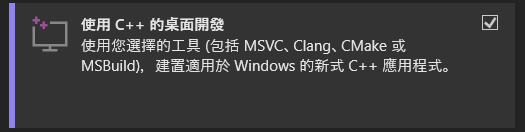
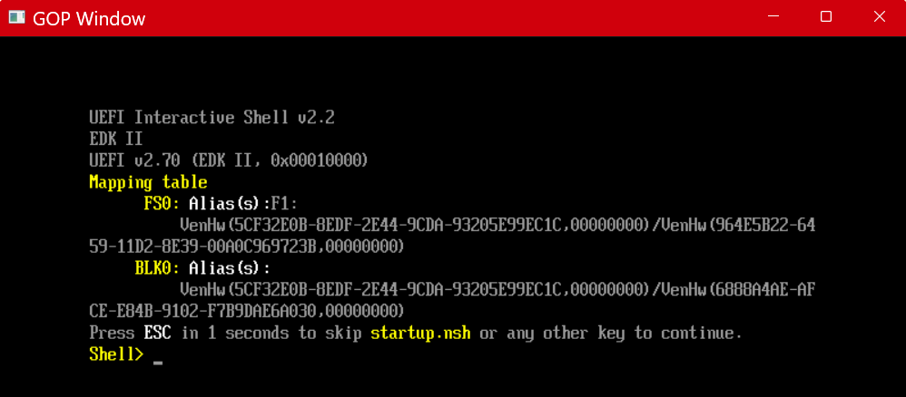
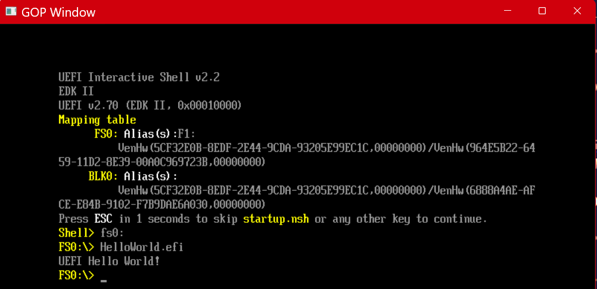

參考自 https://hackmd.io/@IloveFSF/B1x1SNEBy1e

git clone https://github.com/tianocore/edk2.git
git checkout edk2-stable202602

<!-- MSYS2 UCRT64
pacman -S make
cd /d/edk2
make -C BaseTools -->

改用 VS2022
下載 VS2022 後安裝 C++ 工具包

cd edk2
git submodule update --init
.\edksetup.bat Rebuild
Pre-Build 每次都要重新執行
會自動編譯 BaseTools

build -p EmulatorPkg/EmulatorPkg.dsc -a X64

cd Build\EmulatorX64\DEBUG_VS2022\X64
WinHost.exe

切換到第一個虛擬磁碟（FS0）
Shell> fs0:
FS0:\> HelloWorld.efi

OVMF 韌體（QEMU 的 UEFI 實作）
下載 iasl 工具
https://www.intel.com.tw/content/www/tw/zh/download/774881/acpi-component-architecture-downloads-windows-binary-tools.html
set NASM_PREFIX=D:\apps\nasm-3.01\
set IASL_PREFIX=D:\apps\iasl-win-20260408\
build -p OvmfPkg/OvmfPkgX64.dsc -t GCC -a X64 -b RELEASE

建立 uefi_test/bios_dir/EFI/BOOT/
把 efi 檔案(Build/OvmfX64/RELEASE_VS2022/X64/UiApp.efi)複製到 uefi_test/bios_dir/EFI/BOOT/，可以改名成 BOOTX64.EFI 自動啟動
把 OVMF.fd(Build/OvmfX64/RELEASE_VS2022/FV/OVMF.fd)複製到 uefi_test/bios_dir/EFI/BOOT/，可以改名成 OVMF.EFI 自動啟動
qemu-system-x86_64 -bios OVMF.fd -drive format=raw,file=fat:rw:bios_dir
