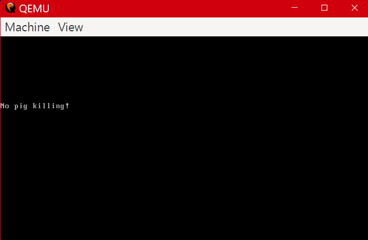
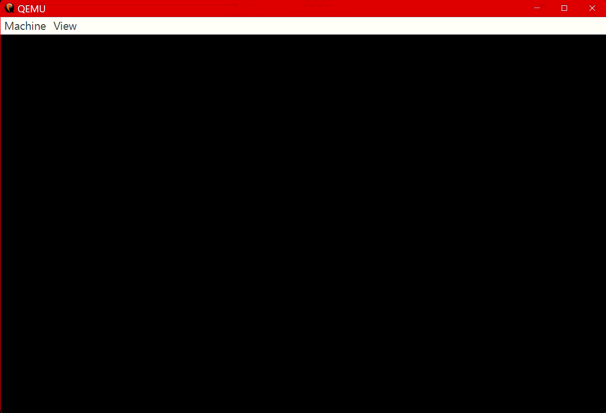

# Learn-UEFI 學習筆記

這是我學習 UEFI 開發的記錄過程。雖然最終目標是 UEFI，但第一步先從傳統的 **Legacy BIOS Bootloader** 開始，這是理解電腦開機流程（Boot Process）最紮實的起點。

---

## 📅 學習日誌

### 2026-05-15：開發環境搭建與第一個 Bootloader

今天完成了基礎環境的建置，並成功撰寫了一個能在真實硬體（虛擬機）上執行的最簡單開機程式。

#### 🛠️ 開發環境配置 (Windows / MSYS2)

為了編譯彙編代碼並運行測試，我們需要以下工具：

1. **QEMU (虛擬機)**
   - **用途**: 模擬 x86 電腦環境，讓我們不需要反覆重啟實體電腦就能測試 Bootloader。
   - **安裝 (MSYS2 UCRT64)**:
     ```bash
     pacman -S mingw-w64-ucrt-x86_64-qemu
     ```
   - **設定**: 將 `C:\msys64\ucrt64\bin` 加入 `PATH`，確保命令列能直接呼叫 `qemu-system-x86_64`。

2. **NASM (彙編編譯器)**
   - **用途**: 將人類可讀的彙編語言 (`.asm`) 轉換成 CPU 可執行的二進制機器碼 (`.bin`)。
   - **下載**: [NASM 官網](https://www.nasm.us/)。

---

#### 💻 核心技術詳解：[`FirstBL.asm`](260515_環境搭建&第一個Bootloader/FirstBL.asm)

這是一個 **Master Boot Record (MBR)** 開機磁區程式。當電腦啟動時，BIOS 會自動搜尋磁碟的第一個磁區（512 位元組），並將其載入記憶體執行。

##### 1. 為何是 `org 0x7c00`？
當 BIOS 完成硬體自我檢測 (POST) 後，它會固定把磁碟的第一個磁區載入到記憶體位址 `0x0000:0x7C00`。`org 0x7c00` 告訴編譯器：「這段程式碼預期會在 0x7C00 位址執行」，這樣程式中所有的記憶體標籤位址才會計算正確。

##### 2. 暫存器初始化 (Real Mode 基礎)
```nasm
xor ax, ax
mov ds, ax
mov es, ax
```
- CPU 剛啟動時處於 **實模式 (Real Mode)**，只有 1MB 的定址空間。
- 我們將段暫存器 (`ds`, `es`) 歸零，確保之後存取資料時，位址計算是從 `0` 開始。

##### 3. 使用 BIOS 中斷 (Interrupts)
在沒有作業系統的情況下，我們透過 BIOS 提供的「服務」來操作硬體，這稱為中斷：
- **`int 0x10, AH=0x06` (清除螢幕)**: 
  - 這會捲動整個螢幕區域，達到清空效果。`BH=0x07` 設定了白字黑底的屬性。
- **`int 0x10, AH=0x0E` (TTY 模式輸出)**:
  - 這是最簡單的文字輸出方式。只需將字元存入 `AL` 暫存器並觸發中斷，螢幕就會顯示該字元。

##### 4. 關鍵的最後兩位元組：`0x55` 與 `0xAA`
```nasm
times 510 - ($-$$) db 0
dw 0xaa55
```
- BIOS 有一個非常嚴格的規定：磁區的第 511 與 512 位元組必須是 `0x55` 與 `0xAA`。
- 如果沒有這個 **開機簽章 (Boot Signature)**，BIOS 會認為這個磁碟不可開機，並報錯 "No bootable device found"。

---

#### 🚀 編譯與執行

1. **編譯二進制檔**：
   ```bash
   nasm -f bin FirstBL.asm -o FirstBL.bin
   ```

2. **啟動虛擬機**：
   ```bash
   # -drive format=raw 告訴 QEMU 這是一個原始的二進制影像檔
   qemu-system-x86_64 -drive format=raw,file=FirstBL.bin
   ```

#### 📸 執行結果


---

### 2026-05-16：EDK2 環境建置與 UEFI 模擬

今天從傳統的 Legacy BIOS 轉向現代的 **UEFI (Unified Extensible Firmware Interface)** 開發。使用了 TianoCore 的開源實作 **EDK2 (EFI Development Kit II)**。

#### 🛠️ 開發環境配置 (Windows / VS2022)

UEFI 開發環境比 Legacy BIOS 複雜許多，需要完整的編譯工具鏈：

1. **Visual Studio 2022**
   - 安裝「使用 C++ 的桌面開發」工具包。這是目前 Windows 下開發 EDK2 最穩定的工具鏈。
   

2. **EDK2 源碼與子模組**
   ```powershell
   git clone https://github.com/tianocore/edk2.git
   git checkout edk2-stable202602
   git submodule update --init
   ```
   - **注意**: EDK2 依賴許多外部函式庫（如 OpenSSL, brotli），必須執行子模組更新。

3. **BaseTools 編譯**
   ```powershell
   .\edksetup.bat Rebuild
   ```
   - 這會自動使用 VS2022 編譯 EDK2 自有的開發工具（如 `GenFv`, `VfrCompile` 等）。

#### 💻 核心技術詳解

##### 1. EmulatorPkg：在 Windows 上模擬 UEFI
`EmulatorPkg` 允許我們在 Windows 視窗中直接運行一個 UEFI 環境（`WinHost.exe`），這對於初步調試應用程式非常方便。

- **編譯命令**:
  ```powershell
  build -p EmulatorPkg/EmulatorPkg.dsc -a X64
  ```
- **執行結果**:
  在 `Build\EmulatorX64\DEBUG_VS2022\X64` 下執行 `WinHost.exe`，可以進入 UEFI Shell 並執行 `HelloWorld.efi`。
  

##### 2. OvmfPkg (Open Virtual Machine Firmware)
OVMF 是專門為虛擬機（如 QEMU/KVM）開發的開源 UEFI 韌體。

- **相依工具**: 需要安裝 `iasl` (ACPI 編譯器) 並設定環境變數 `IASL_PREFIX` 與 `NASM_PREFIX`。
- **編譯**:
  ```powershell
  build -p OvmfPkg/OvmfPkgX64.dsc -a X64 -b RELEASE
  ```
- **測試環境搭建**:
  建立一個模擬磁碟目錄 `uefi_test/bios_dir/EFI/BOOT/`，將編譯出的 `.efi` 檔案重新命名為 `BOOTX64.EFI`。這是 UEFI 的預設啟動路徑，韌體會自動尋找並執行它。

#### 🚀 QEMU 執行命令
```powershell
# -bios 指定 UEFI 韌體檔案
# -drive fat:rw: 指定一個資料夾作為虛擬的 FAT32 磁碟
qemu-system-x86_64 -bios OVMF.fd -drive format=raw,file=fat:rw:bios_dir
```

#### 📸 執行結果


---

## 🔗 參考資料
- [世界第一簡單的UEFI，實作打造自己的開機畫面](https://ithelp.ithome.com.tw/users/20161828/ironman/6446)
- [OSDev Wiki - Boot Sequence](https://wiki.osdev.org/Boot_Sequence)
- [UEFI BIOS 開發環境配置](https://hackmd.io/@IloveFSF/B1x1SNEBy1e)
